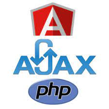
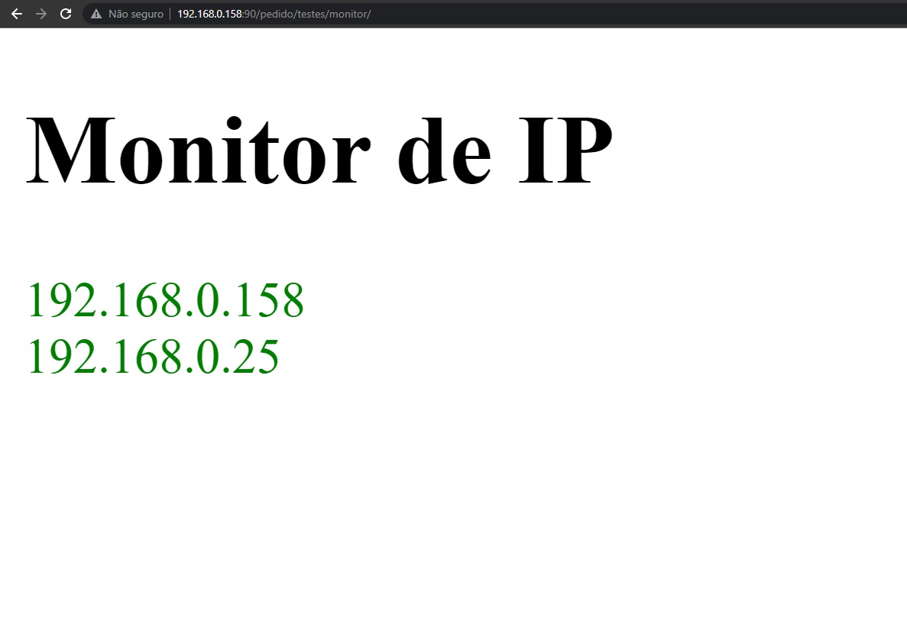
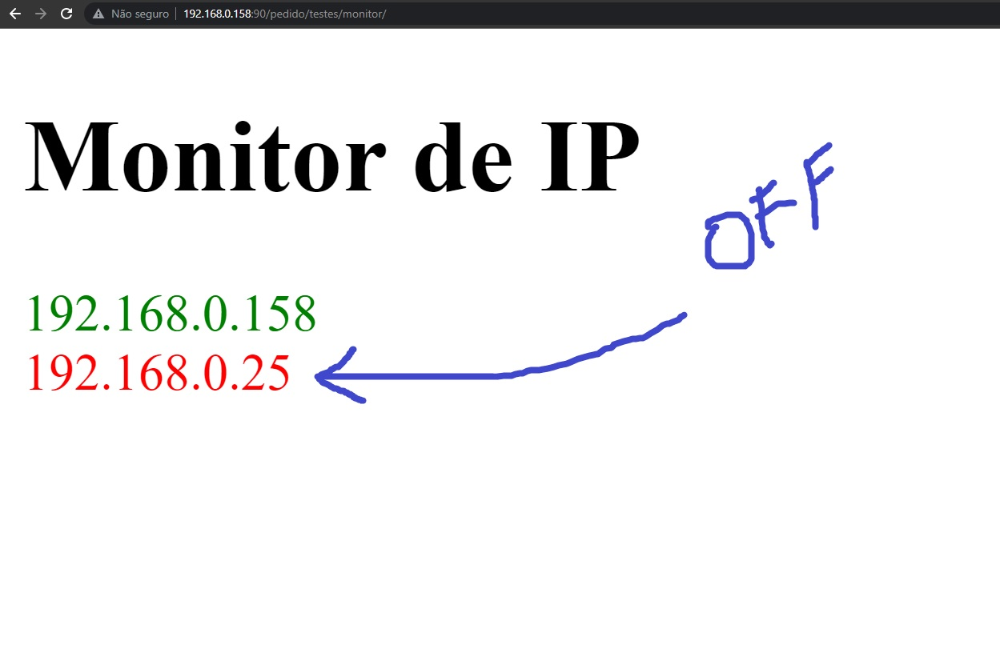
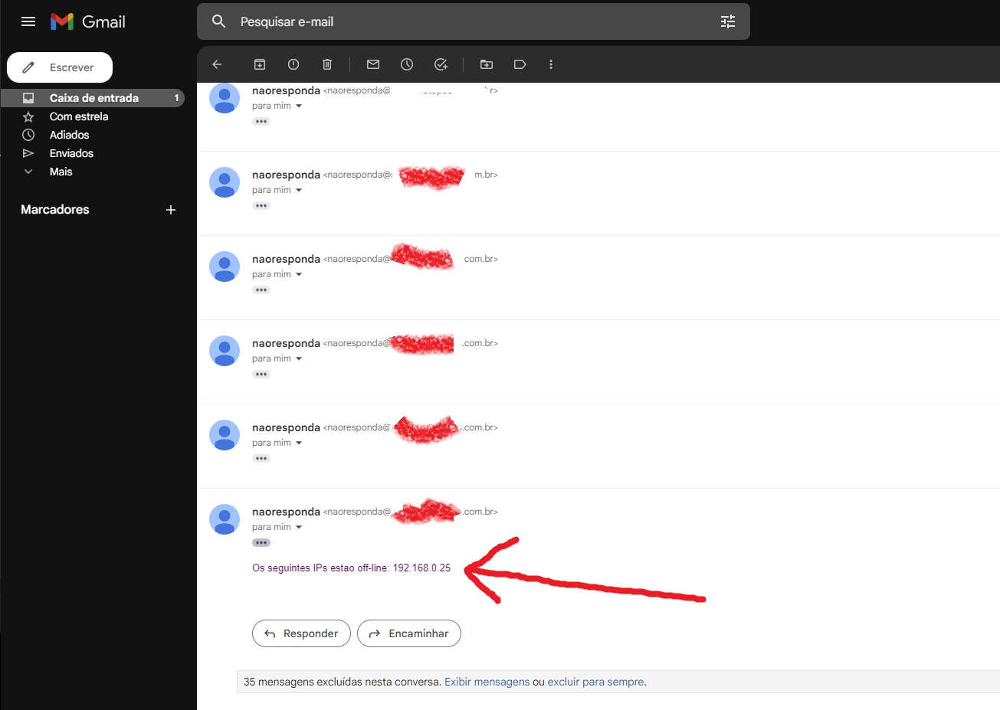

<p align="center">
  
</p>

# Monitoramento de Ips/Portas
Sistema de Monitoramento de IPs/Portas com envio de email caso o IP/Porta do Serviço pare de funcionar

## Objetivo
```bash
Com este exemplo vc pode usar o dominio da AWS e passar os seus parâmetros de credencias

```

## Requisitos
```bash
baixe a bilioteca phpmailer/phpmailer e altere as credenciais de email assim como os 
ips que deseja monitorar

```

## Telas
<p align="center">
  
</p>
<p align="center">
  
</p>
<p align="center">
  
</p>

## suporte

(85) 9 9150-8104 <br>
geraldo@gpsoft.com.br
